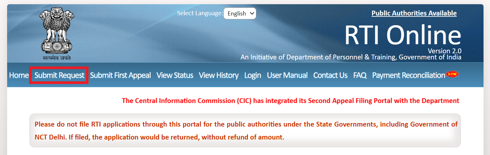
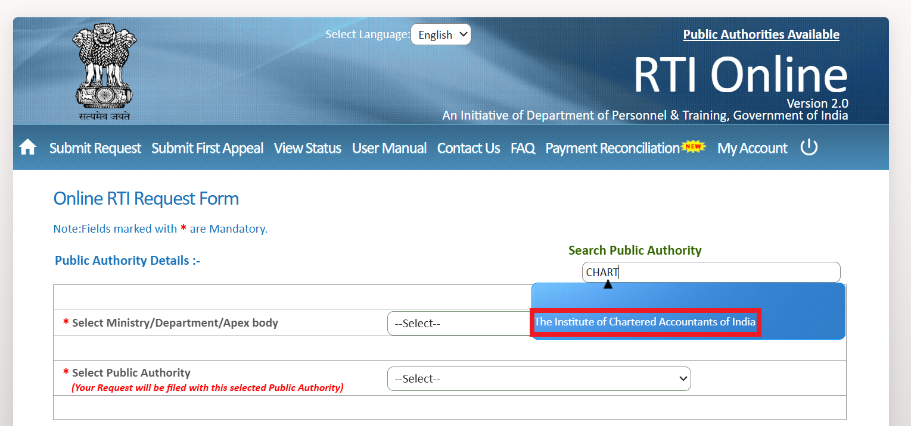

## How CA Students Can Get Their Answer Sheets PDF for FREE under RTI Act (Step-by-Step Guide)

### 🪶 Introduction

Every CA student deserves to know how their papers were evaluated — and the **Right to Information (RTI) Act, 2005** makes that possible for **FREE**.  

In this guide, I’ll show you exactly how to get certified copies of your **ICAI answer sheets in PDF format**, step by step, through the official **RTI Online Portal** — without paying a single rupee to ICAI or any third party.

---

## ⚖️ Legal Basis — Know Who Made This Possible!

Before you begin, let’s acknowledge the judgments that made this transparency possible.  
The right to access evaluated answer sheets was established by two landmark **Supreme Court of India** rulings that strengthened students’ rights under the RTI Act.

### **1️⃣ Central Board of Secondary Education (CBSE) v. Aditya Bandopadhyay & Ors.**
**Civil Appeal No. 6454 of 2011 | [2011 (8) SCC 497]**

In this landmark judgment, the Hon’ble Supreme Court held that *evaluated answer sheets are “information”* within the meaning of **Section 2(f)** of the RTI Act.  
It affirmed that every student has the right to inspect or obtain copies of their own evaluated answer books from examining bodies such as CBSE, universities, and professional institutes.

### **2️⃣ Institute of Company Secretaries of India (ICSI) v. Paras Jain**  
**Civil Appeal No. 5665 of 2014**

This judgment reaffirmed the CBSE ruling and clarified that examining bodies **cannot charge arbitrary or excessive fees** beyond what the RTI Rules prescribe.  
The Supreme Court directed ICSI to provide certified copies at the nominal cost allowed under RTI, ensuring fairness and accessibility.

**Thanks to these two rulings**, students of professional institutes like ICAI, ICSI, and ICMAI can now request **certified copies of evaluated answer sheets under RTI**.  
ICAI has implemented this by providing **free PDF copies** through the RTI Online Portal, eliminating all per-page fees.

---

## 🧭 Step-by-Step Guide: Apply for ICAI Certified Copies via RTI Online

You can obtain certified copies of your evaluated answer sheets for free under the RTI Act using the official portal:  
👉 [https://rtionline.gov.in](https://rtionline.gov.in)

---

### 🔹 Step 1: Visit the RTI Portal and Read the Guidelines

Click on **“Submit Request”** from the top menu (second option from the left after “Menu”).  
You’ll see the **Guidelines for Use of RTI Online Portal** page.

*Click ‘Submit Request’ on the RTI Online Portal homepage.*

**Important notes:**
- Application text is limited to **3000 characters**.  
- Allowed characters: `A–Z, a–z, 0–9, , . - _ ( ) / @ : & ? \ %`  
- **Do not use spaces** in PDF file names.  
- **BPL applicants** (Below Poverty Line) need not pay ₹10 if they upload valid proof.  
- If you pay but don’t receive a registration number immediately, **wait 24–48 working hours**.  
- Application status can be tracked under **“View Status.”**

Tick **“I have read and understood the above guidelines”** and click **Submit**.

---

### 🔹 Step 2: Email Verification

Enter your **email ID** (preferably the same as registered with ICAI), **mobile number**, and the **captcha code**.  
Click **Submit**, then enter the **OTP** received on your email to continue.

---

### 🔹 Step 3: Select Public Authority

In the **Online RTI Request Form**, search for the relevant authority:  
On the top-right, type **“Chartered”** in the *Search Public Authority* box, then select:  
**“The Institute of Chartered Accountants of India (ICAI)”**

*Search and select “The Institute of Chartered Accountants of India (ICAI)” as Public Authority.*

---

### 🔹 Step 4: Fill Personal Details

Enter your details as per ICAI records:
- Name, Gender, Address, PIN Code, Country, State  
- Rural / Urban status  
- Educational status: **Literate**  
- Qualification: **12th Pass / Graduate / Above Graduate**  
- Phone Number (optional)

---

### 🔹 Step 5: Applicant Category

Under **“Is the Applicant Below Poverty Line?”**
- Select **Yes** if you have a **BPL/Food Security Card (FSC)** and upload its PDF (≤1 MB).  
  - Enter *BPL Card Number*, *Year of Issue*, and *Issuing Authority* (e.g. State of Telangana).  
- Select **No** if you don’t have one — you’ll then pay the ₹10 RTI fee.

---

### 🔹 Step 6: Write Your RTI Application

Copy and paste the following text into the application box (fully compatible with RTI portal limits):

> **Respected Sir/Madam,**  
>
> I am submitting this application under the Right to Information Act, 2005 to request certified copies of my evaluated answer sheets for all the papers I appeared in the examination mentioned below.  
>
> **Name:**  
> **Date of Birth:**  
> **Contact No:**  
> **Email Address:**  
> **Student Registration No / SRO No:**  
>
> **Examination Details:**  
> Exam Name: [Foundation / Intermediate / Final]  
> Month and Year: [Month, Year]  
> Roll No: [Your Roll Number]  
>
> A self-attested photocopy of my admit card or hall ticket is enclosed for verification of my identity.  
>
> I request that the certified copies of my evaluated answer sheets be sent to my email address mentioned above.  
>
> **Yours faithfully,**  
> [Full Name]

---

### 🔹 Step 7: Upload Supporting Documents (≤1 MB PDF)

- If **BPL = Yes** → Upload a *merged PDF* containing your BPL/FSC Card and Hall Ticket.  
- If **BPL = No** → Upload only your *Hall Ticket* (optional but helpful).

---

### 🔹 Step 8: Payment and Submission

If **BPL = Yes**, click **Submit** directly — no payment required.  
If **BPL = No**, click **Make Payment** and choose your preferred mode:  
**Internet Banking / Debit or Credit Card / RuPay / UPI**

> ⚠️ Do not refresh or use the back button during payment.  
> If your registration number doesn’t appear immediately, wait 24–48 hours.

Once payment is successful, you’ll see a confirmation message.

*Once submitted, note your RTI Registration Number (e.g., **ICAOI/R/E/25/16XXXX**).*

---

### 🔹 Step 9: Wait for Your Copies

ICAI generally sends certified copies by **email within 30 days**.  
You’ll also receive **SMS and email alerts** once they’re ready.  

You can track your RTI status anytime here:  
👉 [https://rtionline.gov.in/request/status.php](https://rtionline.gov.in/request/status.php)

---

## 🗂️ Important Notes

- ICAI provides **PDF certified copies free of cost** — no per-page charge.  
- Marks **cannot be decreased** after RTI; ICAI has confirmed this officially.  
- Avoid duplicate applications to prevent delays.  
- Always save your **registration number** and acknowledgment email.

---

## ✳️ Final Thoughts

This online process empowers every CA student to verify their evaluation transparently and independently.  
It’s free, lawful, and strengthens accountability within professional education.  
Use your right — **knowledge and transparency cost nothing under RTI.**

---

**Next in Series:**  
📘 *RTI FAQs for CA Students* — “Will my marks decrease?”, “How to cancel RTI?”, “What if ICAI doesn’t reply?” and more.
