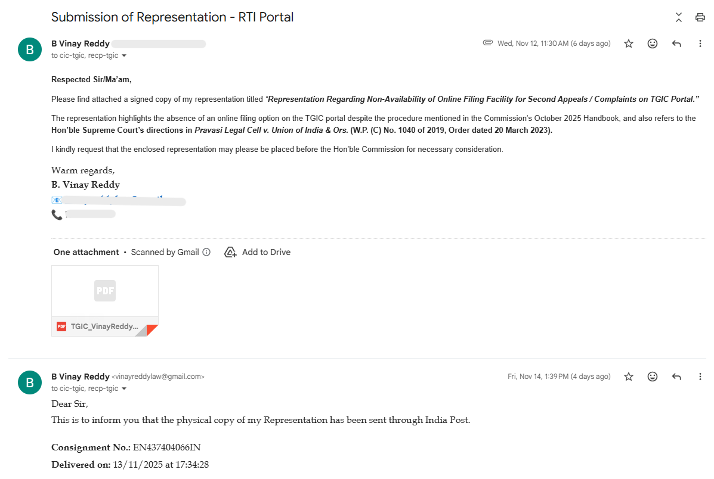
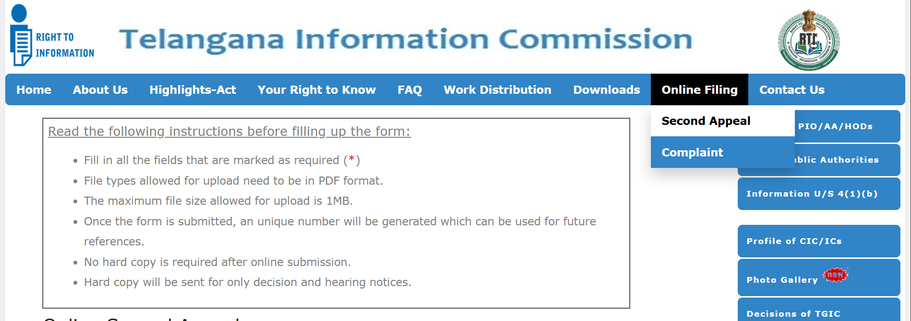

**Estimated Reading Time:** 7 minutes

In a welcome move towards digital transparency, the **Telangana State Information Commission (TGIC)** has now activated the facility for **online filing of Second Appeals and Complaints** on its official website — https://tgic.telangana.gov.in.

This step follows a representation I submitted to the **Hon’ble Chief Information Commissioner** on **12 November 2025**, highlighting that the TGIC Handbook (October 2025 Edition) mentioned the availability of such a facility, though it was not yet operational on the portal.

After review, the Commission promptly acted on the representation.

---

## Background

For quite some time, applicants in Telangana had been facing difficulty filing **Second Appeals** and **Complaints** before the Telangana State Information Commission (TGIC), because the online filing feature — though mentioned in the Commission’s own handbook — was not actually available on the official website.

After noticing this discrepancy, I formally brought it to the notice of the Hon’ble Chief Information Commissioner. What followed was quick and positive administrative action — and the online filing system is now fully functional.

This article documents the entire journey, including the handbook extract, my representation, the emails exchanged, proof of postal delivery, the Commission’s response, and updated screenshots of the TGIC portal.

I hope this experience helps other RTI users and encourages more citizens to raise systemic issues constructively.

---

## 1. Extract from the TGIC Handbook (October 2025 Edition)

While reading the *Handbook on the Right to Information Act, 2005* published by the Commission, I came across the following clear statement on **Page 77**:

> **“A second appeal or a complaint can be filed electronically on https://tgic.telangana.gov.in along with the requisite documents. The documents must be duly signed / self-attested / verified before scanning and attaching with the appeal or complaint being filed.”**

However, when I checked the TGIC portal, no such option was available.  
This discrepancy triggered my formal representation.

---

## 2. My Representation Letter Dated 12-11-2025

On **12 November 2025**, I submitted a detailed representation addressed to:

**Dr. G. Chandrashekar Reddy Garu**  
Hon’ble State Chief Information Commissioner  
Telangana State Information Commission  
Samachara Hakku Bhavan, Hyderabad.

The complete text of my representation is reproduced below:

---

**Date: 12th November, 2025**

**To**  
Dr. G. Chandrashekar Reddy Garu  
The State Chief Information Commissioner  
Telangana State Information Commission  
Samachara Hakku Bhavan  
M.J. Road, Nampally  
Hyderabad – 500001  

**Subject:** Representation regarding non-availability of electronic filing facility for Second Appeals and Complaints on the TGIC portal, and related issues concerning online RTI implementation in Telangana.

**Respected Sir,**

I write this representation in the larger public interest to seek clarification and improvement in the online Right to Information (RTI) systems operated under the jurisdiction of the Telangana State Information Commission.

As per the “Handbook on the Right to Information Act, 2005” (October 2025 Edition), it has been clearly mentioned on Page 77 that:

> **“A second appeal or a complaint can be filed electronically on https://tgic.telangana.gov.in…”**

However, upon visiting the said portal, there appears to be **no option** to file a second appeal or complaint electronically as stated in the handbook. This discrepancy has created confusion among RTI applicants.

Furthermore, the Commission presently does not accept RTI applications submitted through email and insists on physical hard copies. This significantly restricts access, especially for applicants in rural areas, senior citizens, or those unable to visit offices.

I also draw attention to the judgment of the **Hon’ble Supreme Court of India** in *Pravasi Legal Cell v. Union of India* (Order dated 20 March 2023), which directed all States and Union Territories to operationalize online RTI portals in compliance with Section 6(1) of the RTI Act.

**I therefore request the Commission to kindly:**

1. Clarify whether any online facility currently exists for filing Second Appeals or Complaints.  
2. Enable/operationalize such a facility as mentioned in the handbook.  
3. Direct all public authorities to use https://rti.telangana.gov.in for receiving and disposing RTI applications.  
4. Consider accepting RTI filings through email.

These measures would strengthen transparency and accessibility — core objectives of the RTI Act, 2005.

**Yours faithfully,  
(B. Vinay Reddy)**

---

## 3. Email Submission to TGIC (12-11-2025, 11:30 AM)

On the same day, I emailed a signed copy of the representation to:

📩 cic-tgic@telangana.gov.in  
📩 recp-tgic@telangana.gov.in

Below is the screenshot of the email sent:

---

## 4. Official Reply From TGIC (18-11-2025, 12:21 PM)

The response from TGIC was prompt and encouraging. This indicated that the Commission had reviewed the representation and acted upon it.

---

## 5. TGIC Portal Updated – Online Filing Now Active

The TGIC portal is now updated with a new **Online Filing** section with two active links:

- **Second Appeal** — https://tgic.telangana.gov.in/second-appeal-online.do  
- **Complaint** — https://tgic.telangana.gov.in/complaint-online.do  

A screenshot of the updated portal is shown below:

The instructions page also states:

> **“No hard copy is required after online submission. Hard copy will be sent only for decision and hearing notices.”**

This is a major convenience boost for RTI users across Telangana.

---

## Thank-You & Further Suggestions to TGIC

I sent a formal acknowledgment email to TGIC appreciating their prompt action.

I also suggested:

- All **RTI Applications** and **First Appeals** should be handled via https://rti.telangana.gov.in  
- All **Complaints** and **Second Appeals** should be handled via https://tgic.telangana.gov.in  

This ensures a complete, end-to-end digital RTI ecosystem.

---

## A Positive Outcome for Transparency

This experience shows how a well-researched representation from a single citizen can bring meaningful administrative improvements.

A feature mentioned in the handbook but missing on the website is now live.  
Telangana citizens can now file Second Appeals and Complaints electronically — without traveling or sending physical documents.

---

## Conclusion

Digital access is not just convenience — it is integral to transparency, accountability, and the fundamental right to information.

I appreciate the Telangana Information Commission for:

- Considering the representation promptly  
- Enabling the online filing feature  
- Moving toward a modern, citizen-centric RTI ecosystem  

With further improvements, Telangana can become a model State for RTI digital governance in India.

---

<!-- FAQ Schema -->

