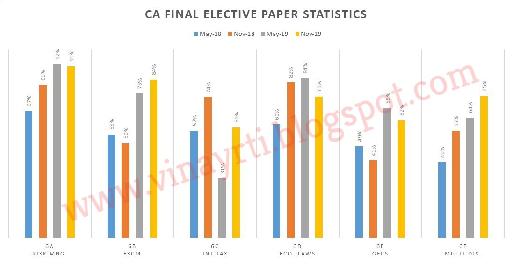
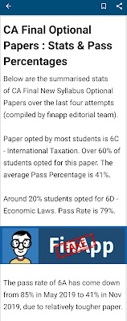
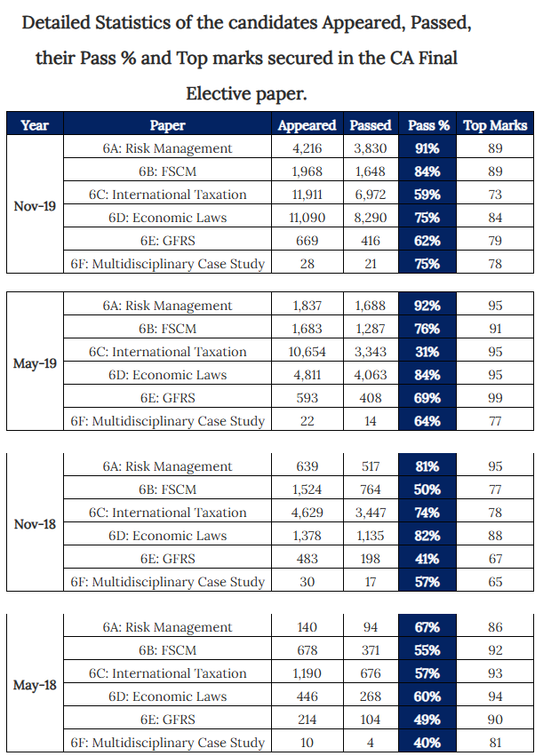

Hello Friends,

I am sharing **official statistics of CA Final Elective papers** for examinations conducted from **May 2018 to November 2019**, obtained **directly from ICAI under the Right to Information Act, 2005**.

📌 **Proof:**  
The **original RTI reply received from ICAI** is attached at the end of this post for verification.

---

## Important Clarification Before You Read the Data

⚠️ **Do not consider this data as the sole criterion for choosing an elective paper.**

Every elective subject is **scoring**, which is clearly evident from the **top marks secured across all electives**. Your interest, aptitude, and preparation matter far more than statistics alone.

---

## Beware of Fake & Unverified Data

A few days after the declaration of CA Final results, an app named **FINAPP** circulated statistics on **21 January 2020**, claiming the data was compiled by its editorial team.

❌ **This data is baseless and misleading.**

When compared with the **official ICAI data obtained under RTI**, the figures shared by FINAPP do not match.

Unfortunately, this is **not the first instance of fake or misleading information** circulated by such platforms. Similar misinformation has previously been spread on issues like **reservation in the CA course**, creating unnecessary panic among students.

### 🚨 Message to Students
**Stay away from unverified apps and posts.**  
Always **ask for the source and proof** before believing or sharing any data.

---

## Official ICAI Statistics (RTI-Based)

Below are the **official statistics of candidates appeared, passed, pass percentage, and top marks** secured in **CA Final Elective Papers** for:

> *Detailed tables are reproduced exactly as received from ICAI.*

(As provided by ICAI under RTI Act, 2005)

---

## Copy of Official RTI Reply

The **complete RTI reply issued by ICAI** is embedded below for transparency and verification:

---

## Important Note on “Exemption” Data

⚠️ **Ignore data related to the number of students securing exemption.**

The RTI reply **does not provide details of all candidates scoring 60 marks or above**.

As per ICAI Regulations:

> **Exemption** means a candidate who appears in all papers of a group but fails in one or more papers, yet secures **60% or more marks in any paper**, is eligible for exemption in that paper for the **next three examinations**.

Hence, exemption figures **cannot be inferred conclusively** from the above data.

---

## Final Words

- Trust **official sources**, not forwarded screenshots  
- RTI remains the **strongest tool for factual clarity**
- Choose your elective based on **interest + preparation**, not fear-driven statistics

