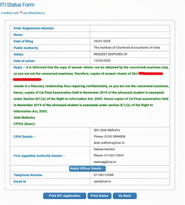

## Can Answer Sheets of Rank Holders or Other Candidates Be Sought Under RTI?

This is a **frequently asked question** among students and RTI applicants:

> **Can I seek answer sheets of rank holders or other candidates under the RTI Act, 2005?**

### ❌ Short Answer: **NO**

---

## Why Such RTI Applications Are Rejected

Under the **Right to Information Act, 2005**, an applicant is **not entitled to seek answer sheets of a third party** (i.e., another candidate), including **rank holders**, for the following reasons:

- Answer sheets contain **personal information**
- Disclosure does **not serve any larger public interest**
- Such information attracts statutory exemptions under the RTI Act

### 📌 Real Example

In one case, even when a student mistakenly wrote only his **short name (“Vinay”) instead of the full name as per ICAI records**, the RTI application was **rejected**. This shows that RTI authorities strictly adhere to identity and ownership of records.

---

## Legal Position Under the RTI Act, 2005

### 🔒 Section 8(1)(j) — Personal Information

> **Section 8(1)(j)**  
> “Information which relates to personal information the disclosure of which has no relationship to any public activity or interest, or which would cause unwarranted invasion of the privacy of the individual, unless the authority is satisfied that the larger public interest justifies the disclosure of such information…”

Answer sheets of other candidates clearly fall within this exemption.

---

### 🔒 Section 8(1)(e) — Fiduciary Relationship

> **Section 8(1)(e)**  
> “Information available to a person in his fiduciary relationship, unless the competent authority is satisfied that the larger public interest warrants the disclosure of such information.”

Examining bodies hold evaluated answer scripts in a **fiduciary capacity**, further strengthening the exemption.

---

## ⚖️ What About Landmark Judgments?

There are **important CIC decisions** which held that:

> A candidate *may* seek answer sheets of other candidates, and such disclosure is **not per se barred** by Sections 8(1)(e) and 8(1)(j).

However, **this principle is not absolute** and is **subject to Sections 3 and 6 of the RTI Act**, meaning:
- The applicant must establish **locus**
- Disclosure must satisfy **public interest**
- The examining body can still deny access on valid grounds

### 📚 References (for academic/legal reading)

- https://indiankanoon.org/doc/141030456/  
- https://indiankanoon.org/doc/1519371/  
- https://www.scconline.com/blog/post/2018/06/13/cic-answer-sheet-of-other-candidates-can-also-be-sought-under-rti/

*(Links are shared for legal understanding; they do not override prevailing ICAI/Exam body practices.)*

---

## ✅ Practical Takeaway for Students

- ✔️ You **can** seek **your own answer sheets** under RTI  
- ❌ You **cannot** seek answer sheets of:
  - Rank holders  
  - Other candidates  
  - Third parties  

Unless you are able to clearly demonstrate **overriding larger public interest**, such RTI applications are bound to be rejected.

---

## 📝 Conclusion

While RTI is a powerful transparency tool, it **does not override privacy rights**.  
For examination-related matters, RTI access is **strictly limited to one’s own records**.

Students are advised to use RTI **wisely and within legal boundaries** to avoid rejection and unnecessary effort.

---

*RTI empowers citizens — but it also respects individual privacy.*
