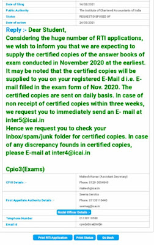

Dear friends,

Many of you have applied for **certified copies of answer sheets under the Right to Information Act, 2005**.  
As per law, ICAI is required to provide the information **within 30 days** from the date of filing the RTI application.

---

## Common Issues Faced by Students

Several students have reported the following problems:

- Certified copies **not received even after 30 days**
- **First Appeals filed**, which again take another 30 days
- SMS received stating that copies were sent by email, **but no email received**
- Different timelines — some received copies in **10–15 days**, while others waited **40–45 days**

Naturally, this has caused confusion and anxiety among students.

---

## Why Is There a Delay?

Due to the **huge number of RTI applications** being filed for certified copies, ICAI is finding it difficult to strictly adhere to the statutory timeline.

Additionally, ICAI is carrying out **suo motu verification of marks** before supplying copies — a process done **in the interest of students**, but which consumes additional time.

Because of this:
- There is **no fixed number of days**
- On average, students are receiving copies within **30–40 days**
- Delays beyond 30 days are occurring in genuine cases

However, you **will receive your copies** — there is no need to panic.

---

## Important Clarification on Marks

I am receiving repeated queries asking:

> *“Can ICAI decrease marks under RTI?”*

Let me state this clearly once again:

👉 **ICAI WILL NOT DECREASE MARKS UNDER RTI.**

- Marks may increase due to verification
- Or copies may be supplied as evaluated
- **Marks will never be reduced** under RTI

I have already written a **separate detailed blog post** on this issue with official sources, and I have explained this on multiple platforms.

---

## Official ICAI Reply on Delay in Supply of Copies

ICAI has officially acknowledged the delay in supplying certified copies due to the **huge volume of RTI applications**, and has also provided contact details for students who have not received copies even after 30–45 days.

Below is the **official RTI reply from ICAI** for your reference.

---

## What Should Students Do?

- Check your **Spam / Junk folder** regularly
- Wait patiently for **30–40 days**
- If copies are still not received, **use the contact details provided by ICAI**
- Avoid unnecessary panic or duplicate RTI applications

---

## Final Words

ICAI is dealing with an **unprecedented volume of RTI requests**.  
Delays are unfortunate, but they are **procedural, not intentional**.

Be assured — **your copies will reach you**, and **your marks are safe**.

---
