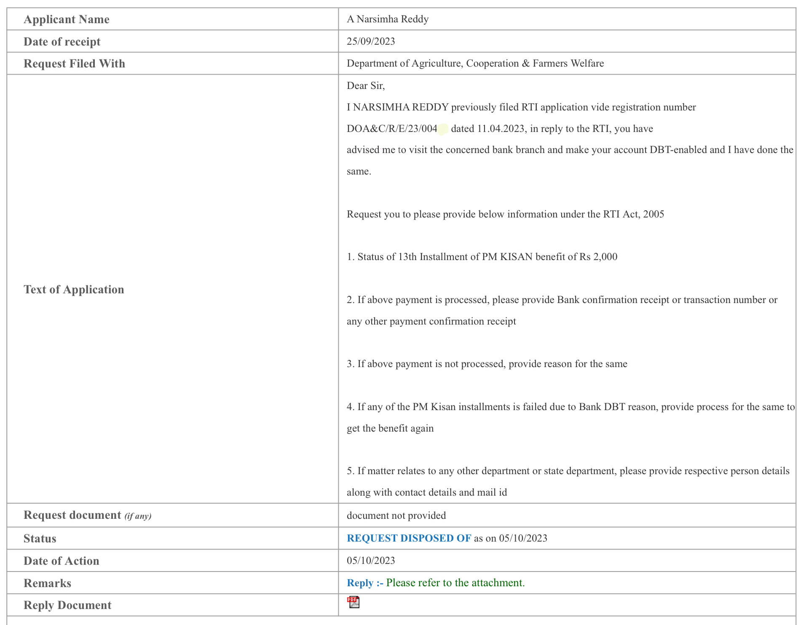
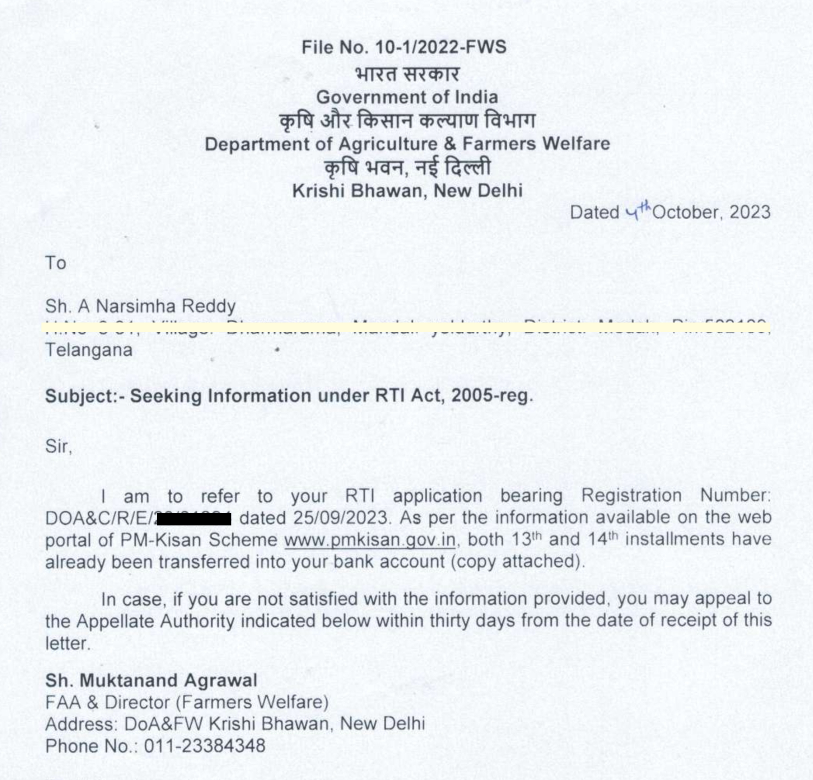

Dear Citizens,

In this article, I would like to highlight **how the Right to Information Act, 2005 can be effectively used by citizens as a powerful tool** to resolve real-life problems.

---

## Success Story

A farmer named **A. Narsimha Reddy**, from Telangana, was worried about his **pending 13th installment of ₹2,000 under the PM-KISAN scheme**, which was supposed to be credited on **27 February 2023**.

A few months prior, he had **closed one of his bank accounts and opened a new account**. Ideally, the amount should have been credited to his new account, as it was linked with **AEPS (Aadhaar Enabled Payment System)**.

However, that did not happen.

He went from **pillar to post**, but no one could give him a clear answer.  
The **State Agriculture Department** expressed helplessness, stating that PM-KISAN is a **centrally sponsored scheme** and they had no option to update bank details.

He approached me seeking help.

This is not the story of a single farmer — I have seen **many farmers facing similar issues**, clueless about what needs to be done. When they approach banks or agriculture offices, they are often **not provided with sufficient or accurate information**.

---

## Attempts Before RTI

I wrote emails to multiple officials in the **Ministry of Agriculture & Farmers Welfare** and **NPCI**. After repeated follow-ups and finally filing an RTI application, one reply stated that:

> **Bank details were not mapped with NPCI**, and Aadhaar needed to be updated at the bank.

The farmer visited the bank and completed Aadhaar updating.  
Yet again, bank officials were clueless and claimed that Aadhaar was already linked.

After escalating the issue to higher banking authorities, it was discovered that:

> **Linking Aadhaar with a bank account and linking Aadhaar–Bank–NPCI are two different processes.**

Finally, Aadhaar was correctly mapped on the **NPCI portal**.  
This entire process itself took **2–3 months**.

---

## Still No Credit

Even after updating everything, the farmer was again told by the Agriculture Office that:

> “It is a central scheme, and the amount will get credited automatically.”

The **14th installment** was credited on **27 July 2023**, but the **pending 13th installment was still missing**.

This clearly showed:
- Bank details were valid  
- NPCI mapping was correct  
- Yet the earlier failed transaction was never retriggered  

Emails stopped getting replies.  
PM-KISAN helpline calls went unanswered.  
The State Agriculture Department had no information.

This exposed the **lack of coordination and information sharing** between Central and State authorities.

The farmer finally **gave up hope** after waiting for nearly **6 months**.

---

## RTI Changed Everything

On **25 September 2023**, I finally filed a **detailed RTI application** covering all aspects of the issue and assured him that there would be clarity soon.

**Within just 2 days of filing the RTI application**, the farmer received a bank SMS:

> **₹2,000 credited to his account.**

Not just his issue — **every farmer in his village facing the same problem also received the pending 13th installment**, which was originally due on **27 February 2023**, but finally credited on **27 September 2023**, after **7 months**.

The joy in the farmer’s eyes was indescribable.

What surprised me most was that **a single RTI application resolved an issue affecting an entire village**.

---

## RTI Application Status Screenshot

---

## Reply from Department of Agriculture & Farmers Welfare

---

## Final Thoughts

**Thanks to the age-old RTI Act, 2005**, which helped a farmer where **new-age Digital India systems failed**.

When the Government has the capability to send SMS alerts informing farmers that PM-KISAN installments are credited,  
**why can’t it send similar alerts explaining what action is required when transactions fail?**

Only the Government has the answer.

I urge the **youth and citizens** to learn and use the **RTI Act, 2005**.  
It may not only help you individually but can also **benefit society at large**.

With recent Supreme Court directions, all States are mandated to operationalise RTI portals.  
By the end of this year, RTI portals across States will be functional, allowing citizens to file RTI applications **from their mobile phones, right from their doorstep**.

**RTI is not just a law — it is a citizen’s voice.**
