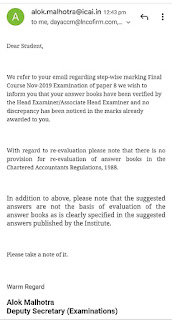

Dear friends,

A **CA Final student**, after receiving **certified copies of answer sheets under the RTI Act, 2005**, noticed that **step-wise marks were not awarded** in his paper.

Believing that marks should have been awarded based on the **Suggested Answers**, the student drafted an email to the **CPIO** and a few **Central Council Members of ICAI**, seeking clarification.

---

## Official Reply from ICAI (Deputy Secretary – Examinations)

In response, the **Deputy Secretary (Examinations), ICAI**, issued a clear and important clarification.

The key points from the reply are:

- **Revaluation of answer books is not permitted** under the Chartered Accountants Regulations, 1988  
- **Suggested Answers are NOT the basis of evaluation** of answer books  
- Examiners are **not bound to award marks strictly based on suggested answers**
- Evaluation is done based on the **overall quality, understanding, and presentation** of answers

This clarification is extremely important, as many students assume that **marks must match the suggested answers word-by-word**, which is not legally or procedurally correct.

---

## Official Email Reply from ICAI

Below is the **official reply received from the Deputy Secretary (Examinations)** for your reference:

---

## What Students Should Understand

- Suggested answers are **only indicative**
- They are meant to **guide examiners**, not bind them
- Different approaches, interpretations, and presentations **can still fetch marks**
- Non-allotment of step-wise marks **does not automatically mean an error**

---

## Final Takeaway

Applying for certified copies under RTI is useful to:
- Understand your performance  
- Improve answer writing  
- Learn presentation techniques  

However, it is important to remember:

👉 **Suggested answers ≠ evaluation benchmark**

Understanding this distinction will help students avoid unnecessary confusion and unrealistic expectations.

