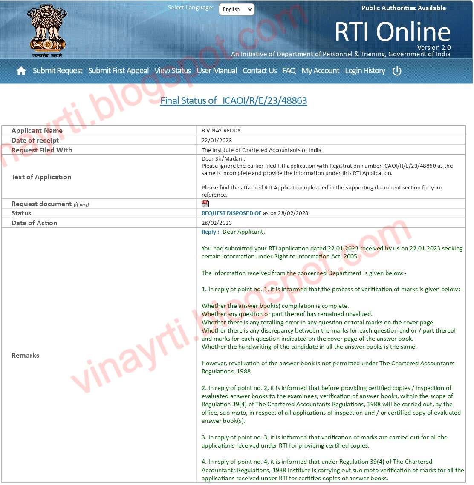

In a reply to the RTI Application bearing **Registration Number ICAOI/R/E/23/48863**, the **Institute of Chartered Accountants of India (ICAI)** has provided a **detailed and categorical clarification** on the process followed while dealing with RTI applications seeking **certified copies of answer sheets**.

This reply is significant, as many students have long-standing doubts regarding **suo motu verification of marks**, rechecking, and revaluation when certified copies are sought under the RTI Act, 2005.

---

## Information Sought in the RTI Application

The RTI application sought clarity on the following points:

1. The **internal process** carried out by ICAI when an RTI application is made for certified copies of answer sheets, including details of:
   - Suo motu verification of marks  
   - Reverification of marks  
   - Rechecking of answer sheets, if any  

2. Whether, while providing certified copies under RTI, the scanned copy / PDF is supplied **as evaluated**, or whether any **rechecking or suo motu verification** of marks is carried out before supply.

3. If suo motu verification is carried out, whether it is done:
   - For **all RTI applications**, or  
   - On a **sample basis**.

4. If ICAI carries out suo motu verification of marks, the **statutory provision / regulation / council decision** under which such verification is undertaken.

---

## Reply by the ICAI

In its reply, ICAI has clearly stated that:

- **Revaluation of answer books is not permitted** under the Chartered Accountants Regulations, 1988.
- However, **verification of marks** is carried out to ensure:
  - All answers are evaluated  
  - No question or part remains unvalued  
  - No totaling errors exist  
  - Marks awarded are correctly carried forward to the cover page  
  - Handwriting consistency of the candidate  

- Before providing **certified copies or inspection of evaluated answer books**, **verification of marks is carried out suo motu** for **all RTI applications**, not on a sample basis.

- Such suo motu verification is carried out under **Regulation 39(4) of the Chartered Accountants Regulations, 1988**.

This reply puts to rest the misconception that ICAI reduces marks or arbitrarily alters results during the RTI process.

---

## RTI Online Reply Screenshot

---

## Conclusion

This RTI reply brings much-needed **transparency and clarity** for students who seek certified copies of answer sheets under the RTI Act.

It confirms that:
- **Marks are verified, not revalued**
- **Verification is mandatory and uniform**
- **The process is backed by statutory regulations**

Once again, the **RTI Act, 2005 proves to be an effective tool** in dispelling doubts and ensuring accountability in examination processes.

*An informed student is an empowered student.*
