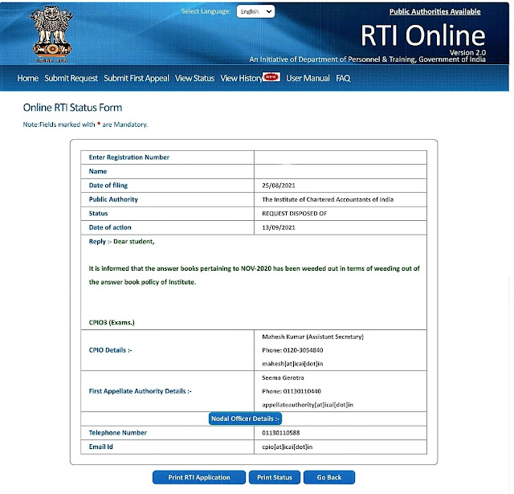

Many CA students continue to have doubts about whether **old answer books are still available** with ICAI.  
A reply received under the **Right to Information Act, 2005** puts this issue to rest.

## What the RTI Reply Says

The RTI reply issued by **CPIO ICAI** clearly states that:

> **Answer books pertaining to November 2020 have been weeded out** in accordance with the Institute’s answer book retention (weeding-out) policy.

This means that **no physical or scanned answer books for Nov-2020 examinations are available** with ICAI as of now.

## Why This Matters

- Students should **not expect copies** of old answer books beyond the prescribed retention period  
- Filing RTIs for such records **will not yield documents** once they are legally destroyed  
- This also reassures students that **marks cannot be altered** post destruction of records

## Official RTI Status Screenshot

## Final Note

Before filing RTI applications related to **answer book copies or re-verification**, it is important to understand ICAI’s **record retention policy** to avoid unnecessary effort and confusion.

*Transparency works best when expectations are aligned with official rules.*

