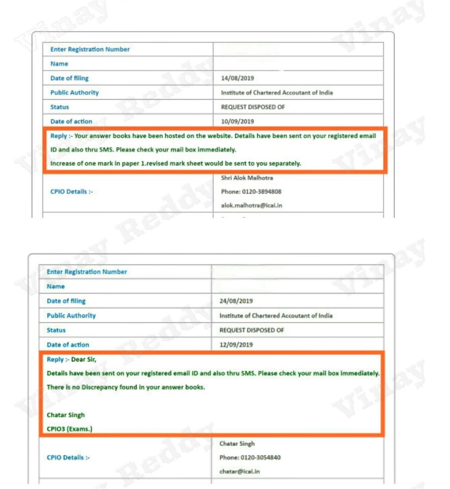

A common fear among CA students while filing an RTI application for **certified copies or verification of answer scripts** is whether marks can be **reduced suo-motu** during the verification process.

This concern has now been **clearly settled**.

---

## ✔️ Is Suo-Motu Verification Done under RTI?

**Yes.**

While processing RTI applications for certified copies of answer books, **ICAI does carry out suo-motu verification of marks**. This verification mainly checks for:

- Totalling errors  
- Unmarked answers  
- Carry-forward mistakes  

However, this verification **does not operate to the detriment of the student**.

---

## 📌 ICAI’s Official Policy: Marks Are Never Reduced

As per **Page 49, Para 7.1** of the **Draft Report dated 14 February 2020** of the **ICAI High-Level Independent Committee**, it has been categorically clarified that:

> *“As a matter of policy, ICAI does not reduce marks already awarded, in the process of verification.”*

This policy assurance is crucial and binding in nature.

---

## 🧾 RTI Replies Confirm the Practice

Actual RTI replies issued by ICAI clearly show that:

- Where discrepancies were found, **marks were increased**
- **No case of reduction of marks** was reported
- Revised mark sheets were issued only when marks increased

This conclusively establishes that **suo-motu verification is student-safe**.

---

## 🎯 What This Means for Students

Students can **confidently apply for certified copies / verification under RTI** even if:

- They have scored **exactly 40 or 60** in a paper, or  
- They have passed a group with **exactly 200/400 marks**

➡️ **There is absolutely no risk of marks being reduced** due to RTI-based suo-motu verification.

---

## ✅ Conclusion

RTI is a **transparent, accountable, and student-friendly mechanism** that helps ensure fairness in evaluation.

The fear of mark reduction during RTI verification is **unfounded and contrary to ICAI’s stated policy**.

Students should therefore **not hesitate** to seek certified copies or verification of their answer scripts under the RTI Act.

---

*Transparency strengthens trust. RTI strengthens transparency.*

