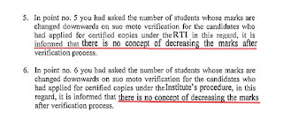
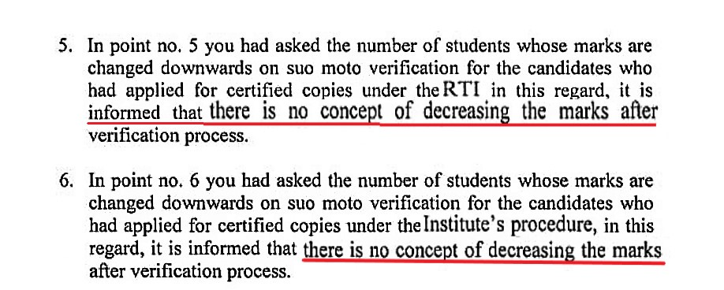
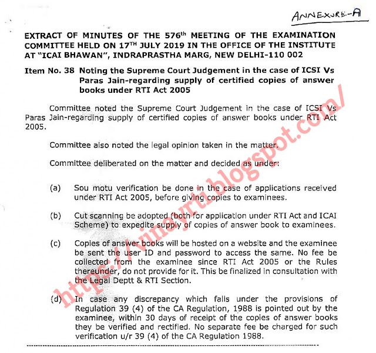
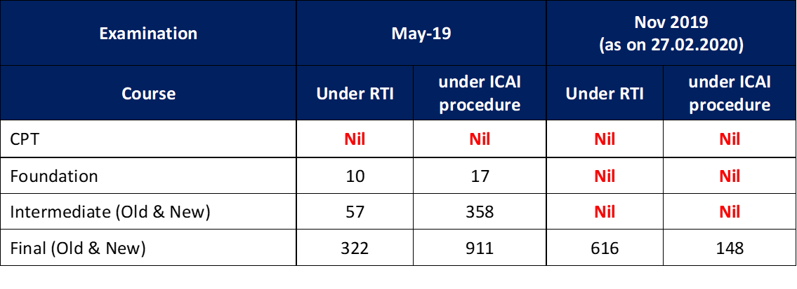

Many students apply for **certified copies of their answer sheets** either under the **RTI Act, 2005** or under the **Institute’s procedure**.

Some want to:
- Understand their mistakes  
- Improve presentation  
- Guide juniors  
- Preserve copies as a learning reference  

However, a **constant fear** persists among students:

> *“What if ICAI reduces my marks during suo motu verification?”*

This fear is especially high for students who:
- Scored **exactly 40 (pass)**  
- Scored **60 (exemption)**  
- Cleared groups with **exactly 200 or 400 marks**

The panic question is always the same:

**Will ICAI fail me if I apply only to view my answer sheet?**

---

## Friends, Relax — The Answer Is a BIG NO ❌

Let me be very clear.

👉 **ICAI does NOT decrease marks** on verification or suo motu verification.

---

## Legal & Factual Position

### 1️⃣ RTI Applications Never Ask for Verification

- Nowhere in an RTI application do we request verification of marks  
- We only seek **certified copies of evaluated answer sheets**

### 2️⃣ No Prior Intimation to Students

- ICAI never issues any announcement stating that marks will be decreased during RTI-based supply of copies

### 3️⃣ Official Confirmation: No Decrease in Marks

ICAI has categorically replied under RTI that:

> **“There is no concept of decreasing the marks after verification process.”**

This applies to:
- Applications under **RTI Act**
- Applications under **ICAI’s own procedure**

---

## RTI Reply Clearly Saying Marks Are NOT Decreased

---

## Why Does ICAI Still Do Suo Motu Verification?

Yes — ICAI **does carry out suo motu verification**, but **ONLY in the interest of students**.

This was officially decided by the **Examination Committee**.

---

## Examination Committee Decision (576th Meeting)

The **576th Examination Committee Meeting** held on **17 July 2019** at **ICAI Bhavan, New Delhi**, decided:

- Suo motu verification will be done before giving copies  
- Digital scanning to speed up supply  
- Copies to be hosted online  
- **If any discrepancy under Regulation 39(4) is found, it will be rectified**
- **No fee for rectification**
- **No decrease of marks**

---

### Extract of Examination Committee Minutes (Received under RTI)

---

## Opportunity Given to Students (Regulation 39(4))

If a student notices:
- Totalling mistakes  
- Unevaluated answers  
- Mark transfer errors  

They can report it **within 30 days** of receipt / hosting of copies.

This is **student-friendly**, not punitive.

---

## RTI Data: Actual Statistics Don’t Lie

I sought information under RTI regarding:

### ✔️ Marks Increased on Suo Motu Verification  
### ❌ Marks Decreased on Suo Motu Verification  

---

### Statistical Data (May 2019 & Nov 2019 Exams)

📌 **Important Observation**  
For **Foundation, Intermediate, IPCC, and Final exams (Digital Evaluation)**:

> **There is NOT A SINGLE CASE where marks were decreased.**

---

## Final Confirmation from ICAI (Under RTI)

When asked specifically about **downward change of marks**, ICAI replied:

> **“There is no concept of decreasing the marks after verification process.”**

This reply applies to:
- RTI applications  
- ICAI procedure applications  

---

## Conclusion

The fear that:
- ICAI will reduce marks  
- Students will be failed  
- Students will be blacklisted  
- RTI applicants will be punished  

👉 **All these are myths.**

ICAI acts **positively and in good faith** towards students.  
We are the **future members of the profession**, not adversaries.

Yes, there is a **communication gap**, but I have full faith in the leadership of ICAI, especially under **CA Atul Gupta Sir**, known for progressive reforms.

---

## Final Message to Students

📌 **Apply for certified copies without fear**  
📌 **RTI is your legal right**  
📌 **Marks will NOT be reduced**  
---

### Reference

RTI Application dated **04 February 2020**  
Application No: **ICAOI/R/E/20/18851**  
Reply dated **05 March 2020**
